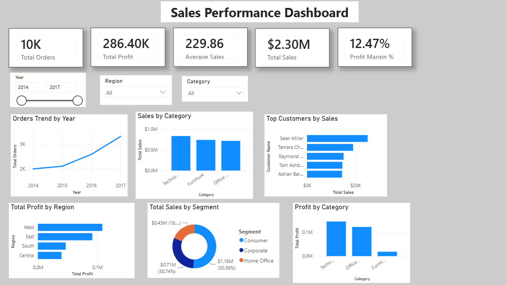

# 📊 Sales Performance Dashboard

An end-to-end **Data Analytics project** analyzing 9,994 Superstore sales records to identify trends in sales, profitability, customer performance, regional performance, and product categories.

The project demonstrates a complete analytics workflow using **Python, SQL, SQLite, and Power BI**, transforming raw sales data into actionable business insights through data cleaning, analysis, KPI development, and interactive visualization.

---

## 🎯 Business Problem

Retail businesses generate large amounts of sales data, but raw data alone does not provide clear answers to important business questions.

This project analyzes Superstore sales data to answer questions such as:

- How much revenue and profit is the business generating?
- How are orders changing over time?
- Which categories generate the most sales and profit?
- Which regions are the most profitable?
- Which customer segments contribute the most revenue?
- Who are the highest-value customers?
- Which areas may require further investigation?

The final output is an interactive Power BI dashboard designed to provide a quick overview of business performance and support data-driven decision-making.

---

## 📌 Project Highlights

- Analyzed **9,994 sales records**
- Cleaned and transformed raw data using **Python and Pandas**
- Built a **SQLite database** for structured analysis
- Wrote **25+ SQL queries** to answer business questions
- Created business KPI measures using **DAX**
- Built an interactive **Power BI dashboard**
- Added dynamic filtering using **Year, Region, and Category slicers**
- Performed **Top 10 customer analysis**
- Generated actionable business insights from the analysis

---

## 🛠️ Tech Stack

| Tool | Purpose |
|---|---|
| **Python** | Data cleaning and preprocessing |
| **Pandas** | Data manipulation and analysis |
| **NumPy** | Numerical operations |
| **Matplotlib** | Exploratory visualization |
| **SQLite** | Relational data storage |
| **SQL** | Business analysis and aggregation |
| **Power BI** | Interactive dashboard and visualization |
| **DAX** | KPI and calculated measures |
| **Git & GitHub** | Version control and project management |
| **Jupyter Notebook** | Exploratory data analysis |

---

## 📂 Project Structure

```
sales-performance-dashboard/
│
├── data/
│   ├── raw/
│   └── cleaned/
│
├── database/
│   └── sales.db
│
├── scripts/
│   ├── 01_data_cleaning.py
│   ├── 02_create_database.py
│   └── 03_sql_analysis.py
│
├── sql/
│   └── queries.sql
│
├── dashboard/
│   └── Sales_Performance_Dashboard.pbix
│
├── screenshots/
│   └── day3_dashboard.png
│
├── business_insights.md
├── README.md
├── requirements.txt
└── .gitignore
```

# 📈 Dataset

**Dataset:** Superstore Sales Dataset

The dataset contains **9,994 records and 21 columns** covering customer orders, products, shipping, sales, discounts, and profitability.

### Key Fields

- Order ID
- Order Date
- Ship Date
- Customer Name
- Segment
- Region
- State
- Category
- Sub-Category
- Product Name
- Sales
- Quantity
- Discount
- Profit

---

# 🔄 Analytics Workflow

```
Raw Dataset
     │
     ▼
Data Cleaning & Preparation
     │
     ▼
Exploratory Data Analysis
     │
     ▼
SQLite Database
     │
     ▼
SQL Business Analysis
     │
     ▼
KPI & Metric Development
     │
     ▼
Power BI Dashboard
     │
     ▼
Business Insights
```

# 🧹 Data Preparation

Python and Pandas were used to prepare the dataset for analysis.

### Data preparation included:

- Loading the raw dataset
- Inspecting data types
- Checking missing values
- Checking duplicate records
- Converting date fields to datetime
- Creating Year and Month fields
- Creating additional calculated fields
- Validating the cleaned dataset
- Exporting the cleaned dataset

The cleaned data was then used for SQL and Power BI analysis.

---

# 🗄️ SQL Analysis

The cleaned dataset was imported into a SQLite database and analyzed using SQL.

More than **25 SQL queries** were written to investigate sales and profitability.

### SQL concepts used:

- `SELECT`
- `WHERE`
- `GROUP BY`
- `ORDER BY`
- `LIMIT`
- `HAVING`
- `COUNT()`
- `SUM()`
- `AVG()`
- `MAX()`
- `MIN()`
- `ROUND()`
- `NULLIF()`
- `AND`
- `OR`
- `IN`

# 📊 Power BI Dashboard

The final dashboard provides an interactive overview of business performance.

## KPI Cards

| KPI | Result |
|---|---:|
| Total Orders | **10K** |
| Total Profit | **286.40K** |
| Average Sales | **229.86** |
| Total Sales | **$2.30M** |
| Profit Margin | **12.47%** |

## Dashboard Visualizations

### 📈 Trend Analysis

- Orders Trend by Year

### 🏷️ Category Analysis

- Sales by Category
- Profit by Category

### 👥 Customer Analysis

- Top 10 Customers by Sales

### 🌎 Regional Analysis

- Total Profit by Region

### 👤 Segment Analysis

- Total Sales by Segment

### 🎛️ Interactive Filters

- Year
- Region
- Category

The dashboard allows users to dynamically filter the visualizations and investigate different portions of the dataset.

---

# 📷 Dashboard Preview



# 💡 Key Business Insights

### 1. Technology leads category sales

**Technology generates the highest sales**, followed by Office Supplies and Furniture.

This indicates that Technology is the strongest sales-driving category in the dataset.

### 2. Technology is also the most profitable category

Technology generates the highest profit, while **Furniture generates the lowest profit**.

The combination of lower sales and lower profit makes Furniture an area that may require further investigation.

### 3. West is the most profitable region

The **West region generates the highest profit**, followed by East, South, and Central.

This suggests that regional performance varies significantly and could be investigated further to understand the drivers of profitability.

### 4. Consumer is the largest customer segment

The **Consumer segment contributes the highest sales**, followed by Corporate and Home Office.

This makes Consumer customers an important segment for retention and marketing strategies.

### 5. Order volume increased over time

Order volume shows an overall upward trend from **2014 to 2017**, with 2017 recording the highest order activity.

This indicates growing order activity over the analyzed period.

### 6. High-value customers contribute significantly to sales

**Sean Miller** is the highest-sales customer shown in the Top 10 customer analysis.

This demonstrates the importance of identifying and retaining high-value customers.

### 7. Overall profit margin is 12.47%

The business generates approximately **$12.47 in profit for every $100 in sales**.

This provides a baseline for comparing profitability across categories, regions, and customer segments.

# 📌 Key Takeaways

| Area | Finding |
|---|---|
| Highest Sales Category | **Technology** |
| Lowest Sales Category | **Furniture** |
| Highest Profit Category | **Technology** |
| Lowest Profit Category | **Furniture** |
| Most Profitable Region | **West** |
| Highest Sales Segment | **Consumer** |
| Top Customer by Sales | **Sean Miller** |
| Highest Order Year | **2017** |
| Lowest Order Year | **2014** |
| Overall Profit Margin | **12.47%** |

---

# 🧠 Skills Demonstrated

## Data Analytics

- Data Cleaning
- Exploratory Data Analysis
- Feature Engineering
- KPI Development
- Business Analysis
- Data Storytelling
- Insight Generation

## Python

- Pandas
- NumPy
- Matplotlib
- Data preprocessing
- SQLite integration

## SQL

- Aggregation
- Filtering
- Grouping
- Sorting
- Conditional analysis
- Business KPI calculations
- SQLite database querying

## Power BI

- Data Modeling
- DAX Measures
- KPI Cards
- Line Charts
- Bar Charts
- Column Charts
- Donut Charts
- Top N Analysis
- Slicers
- Interactive Filtering
- Dashboard Layout
- Visual Formatting

## Tools

- Git
- GitHub
- Jupyter Notebook
- SQLite
- Power BI Desktop

# 📁 Project Deliverables

- Cleaned sales dataset
- Python data cleaning scripts
- SQLite database
- SQL business analysis queries
- Power BI dashboard
- Business insights report
- Dashboard screenshot
- Project documentation

---

# 🚀 Future Improvements

Potential extensions to the project include:

- Add monthly and quarterly sales analysis
- Analyze profit by sub-category
- Analyze the impact of discounts on profitability
- Add year-over-year growth metrics
- Add sales forecasting
- Add drill-through pages for customer and product analysis
- Deploy the dashboard using Power BI Service
- Automate the data refresh pipeline

---

# 👩‍💻 Author

**Sadikshya Adhikari**

Computer Engineering Student | Aspiring Data Analyst | AI & ML Enthusiast

---

⭐ If you found this project useful, feel free to explore the analysis, SQL queries, and Power BI dashboard.

